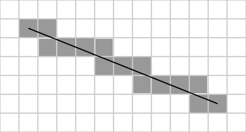

# LineRasterizer

## Usage

### Get all points

    use rust_line_rasterizer::LineRasterizer;

    let points: Vec<Point> = LineRasterizer::new((0, 0), (2, 4)).collect();
    println!("points = {:?}", points);
    // points = [(0, 1), (1, 1), (1, 2), (1, 3), (2, 3), (2, 4)]

### Iterate points

    use rust_line_rasterizer::LineRasterizer;

    let line_rasterizer_iter = LineRasterizer::new((0, 0), (2, 4));

    for point in line_rasterizer_iter {
        // (0, 1)
        // (1, 1)
        // (1, 2)
        // (1, 3)
        // (2, 3)
        // (2, 4)
    }
